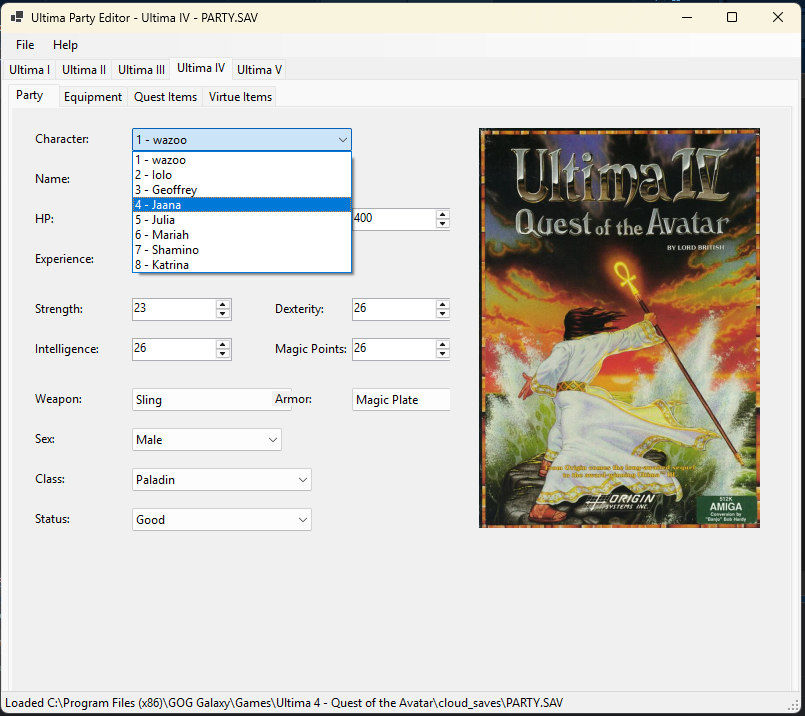

# Ultima Party Editor

Hail Avatar! Here is a tool to help you and your party on your journeys through
Sosaria!

## INSTALLATION NOTES

- In the github project's `Releases` area will be a downloadable zip file
- Extract and run!

## USER GUIDE

- Use the Ultima tab you wish to use
- Use the **File->Open** menu item to load the appropriate save game file
- Edit at your leisure
- Use **File->Save** to save your changes. **NB: A backup will be auto-generated to preserve your original**

## DEVELOPER GUIDE

- Clone the project `git clone git@github.com:erikyuzwa/ultima-party-editor.git`
- Open in Visual Studio Community 2026 or any compatible editor
- **PULL REQUESTS WELCOMED**

## CREDITS

- [Lord British](https://x.com/RichardGarriott) and all who helped him through the ages with design, coding and inspiration.
- [Ultima Codex](https://wiki.ultimacodex.com/) for box art images and overall Ultima project information
- Martin Brenner's [Ultima Save Game Format Documentation](https://martin.brenner.de/ultima/)
- Xenerkes Dragon's [Ultima Savegame Editor](https://ultima1.ultimacodex.com/the-ultima-savegame-editor/) for the inspiration and groundbreaking work!
- My dad for letting me move the family's AppleIIe to my bedroom at 12 so I
could stay up all night fighting orcs in Britannia.
            

"Moreover, brethren, I declare unto you the gospel which I preached unto you, which also
ye have received, and wherein ye stand; By which also ye are saved, if ye keep in memory
what I preached unto you, unless ye have believed in vain.

For I delivered unto you first of all that which I also received, how that Christ died
for our sins according to the scriptures;

And that he was buried, and that he rose again the third day according to the scriptures:"
- 1 Corinthians 15:1-4

Resolve your Eternal destination right now! 

## LICENSE

Copyright 2026 Erik Yuzwa

Permission is hereby granted, free of charge, to any person obtaining a copy of this
software and associated documentation files (the “Software”), to deal in the Software
without restriction, including without limitation the rights to use, copy, modify, merge,
publish, distribute, sublicense, and/or sell copies of the Software, and to permit
persons to whom the Software is furnished to do so, subject to the following conditions:

The above copyright notice and this permission notice shall be included in all copies or
substantial portions of the Software.

THE SOFTWARE IS PROVIDED “AS IS”, WITHOUT WARRANTY OF ANY KIND, EXPRESS OR IMPLIED,
INCLUDING BUT NOT LIMITED TO THE WARRANTIES OF MERCHANTABILITY, FITNESS FOR A PARTICULAR
PURPOSE AND NONINFRINGEMENT. IN NO EVENT SHALL THE AUTHORS OR COPYRIGHT HOLDERS BE LIABLE
FOR ANY CLAIM, DAMAGES OR OTHER LIABILITY, WHETHER IN AN ACTION OF CONTRACT, TORT OR
OTHERWISE, ARISING FROM, OUT OF OR IN CONNECTION WITH THE SOFTWARE OR THE USE OR OTHER
DEALINGS IN THE SOFTWARE.